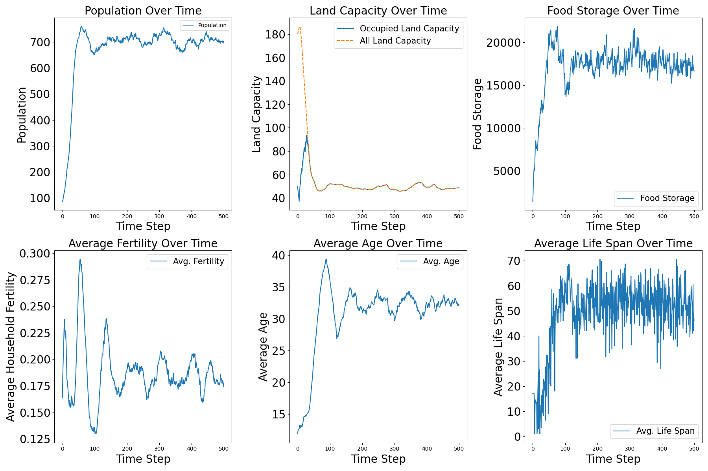

# Agent-Based Model 2024 Version
**Author**: Yutong Liang  
**Supervisor**: Dániel Kondor​  
**Topic**: Investigating Social Dynamics and Inequality in Neolithic Societies Through Agent-Based Modelling
### Introduction
The project aims to study the social dynamics in the neolithic time with Agent-Based Model.

### Current Progress
Agents (villagers) can farm, eat, involves birth and death, marriage, splitting out of their current household. On the household level, they can migrate to different area. Households can also trade with other households in exchange for longer-storage value instead of easily expired food. On the village level, it is possible to establish crop rotation system which requires each land to be fallowed every certain years. It is also possible to convert to fishing when a household's land is currently on fallow.

### Usage Manual
- Branch in the use: `main`
- Run the main.py after configuring the parameters

- Interface usage: so far, a simple simulation interface can be used locally. Please run the `interaction.py` and access the interface.

### Object Classes

- `Agent`
- `Household`
- `Village`

Additionally, the `utils.py` file contains functions primarily for initialization and printing, while `demog_vectors.csv` provides parameters for age-structured population data such as *age-group based survival probablies, fertility rates, consumption needs, work capabilities (Y/N), etc.*
## Year 2023 Summer Work
### Population Growth Model -  Leslie Matrix
In the initial phase of the project, we used logistic growth model to account for the population growth. 

```math
\begin{align}
\frac{dx}{dt} &= \alpha x - \beta xy \\
\frac{dy}{dt} &= \delta xy - \gamma y
\end{align}
```

where:
```math
\begin{align*}
x & : \text{Prey population density} \\
y & : \text{Predator population density} \\
\alpha & : \text{Prey birth rate} \\
\beta & : \text{Predation rate coefficient} \\
\delta & : \text{Conversion efficiency of prey to predators} \\
\gamma & : \text{Predator death rate}
\end{align*}

```
The project builds upon the Lotka-Volterra predator-prey model to study interactions between resources (prey) and consumers (predators). In this adaptation, resources, such as land carrying capacity, are analogous to prey, while farmers or settlers represent predators. The classic model assumes that prey grows exponentially in the absence of predators, while predators decline without prey, with interaction terms accounting for resource consumption and predation. To enhance realism, the model incorporates logistic growth, introducing an upper limit to resource levels based on environmental constraints.
```math
\begin{align}
    {{N^{(t+1)}}} = {{N^{(t)}}} + r\cdot {{N^{(t)}}} (1-\frac{{N^{(t)}}}{{P}})
\end{align}
```
where:
```math
\begin{align*}
N & : \text{"Prey" population} \\
P & : \text{Total "Predator"} \\
t & : \text{Year}
\end{align*}
```

A key deviation in this project is the use of constant initial growth for resources instead of logistic growth. However, settlers retain logistic growth dynamics while responding to environmental factors. The model also features a carrying capacity mechanism for resources, where land cells are proportionally depleted when used and recover annually until reaching maximum capacity. These modifications create a more flexible model that better reflects the interplay between population and environmental factors.

### Model I Description Summary

Model I simulates agent-based interactions between population and resource dynamics in a Neolithic village. The village consists of settlers farming land divided into cells, with each cell farmed by one settler. Resources are distributed communally, and farmers migrate annually to maximize efficiency, using only the minimum land necessary to meet the village’s needs. Land cells are depleted after use but recover annually. Population growth follows a logistic model, but external death rates due to shocks or diseases are introduced.

**Key Equations**:

1. Population Growth:
```math

\begin{equation}
\frac{dP}{dt} = r_P \cdot P(t) \cdot \left(1 - \frac{P(t)}{K_P}\right) \cdot \left(\frac{F(t)}{K_F}\right) - d_P \cdot P(t)
\end{equation}
```

where $rP$ is the birth rate, $K_P$ is the population carrying capacity, $F(t)$ represents available food, $K_F$ is food carrying capacity, and dP is the death rate.

2.	Population Update:
```math
N(t+1) = N(t) + r \cdot N(t) \cdot \left( 1 - \frac{N(t)}{P} \right) - d \cdot N(t)
```
3.	Carrying Capacity for Each Land Cell:

```math
K(t+1)_i = \max\left( \min\left( K^*_i, K^t_i + k(K^*_i - K^t_i) - a \cdot K^t_i \cdot u^t_i \right), 0 \right)
```

where $K^*_i$ is the maximum carrying capacity, $K^t_i$ is the previous year’s capacity, $k$ is the recovery rate, a is the depletion rate, and $u^t_i$ is land usage.

4.	Total Carrying Capacity:

```math
K_t = \sum_{i=1}^M u^t_i K^t_i
```
with $M$ as the total number of land cells.

The simulation revealed that population and resource capacity converge to a steady state, but growth is constrained due to overlapping controls from the logistic equation and migration mechanism. Modifying the population growth model resolves this conflict, allowing sustainable growth.


<p style="text-align: center;">
Figure 1. Model I Simulation Results</p>


### Alternative Approach: Leslie Matrix

To address the issue, the Leslie Matrix introduces an age-structured model for population growth:

```math 
N_{t+1} = L \cdot N_t
```

where $L$ is the Leslie matrix defining fertility and survival rates, and $N_t$ is the population vector. The method accounts for ageing and fertility, ensuring realistic population projections.

```math
\begin{bmatrix}
N_{0, t+1} \\
N_{1, t+1} \\
N_{2, t+1} \\
\vdots \\
N_{n, t+1}
\end{bmatrix}
=
\begin{bmatrix}
N_{0, t} \\
N_{1, t} \\
N_{2, t} \\
\ldots \\
N_{n, t}\\
\end{bmatrix}
\cdot
\begin{bmatrix}
f_0 & f_1 & f_2 & \ldots & f_{n-1} & f_n \\
p_0 & 0 & 0 & \ldots & 0 & 0 \\
0 & p_1 & 0 & \ldots & 0 & 0 \\
0 & 0 & p_2 & \ldots & 0 & 0 \\
\vdots & \vdots & \vdots & \ddots & \vdots & \vdots \\
0 & 0 & 0 & \ldots & p_{n-1} & 0 \\
0 & 0 & 0 & \ldots & 0 & p_n \\
\end{bmatrix}

```

### Model II: Population Update with Leslie Matrix

Model II resolves the conflict in Model I by replacing the logistic growth equation with the Leslie matrix, a discrete, age-structured population growth model. This approach incorporates empirical demographic data (Coulson & Tuljapurkar, 2008) to provide realistic age-class survival, fertility rates, and food-dependent population dynamics.

The Leslie matrix updates population by incorporating food availability ($z$), defined as the ratio of harvested food to consumption demand. Fertility is scaled by $z$ when $z<1$, while high $z$ scenarios are not penalized to avoid unrealistic population growth. The population is updated yearly using:

```math 
N_{t+1} = L \cdot N_t
```

Where $L$ is the Leslie matrix, and $N_t$ is the population vector at time $t$. Food availability introduces feedback, ensuring population growth aligns with resource constraints.

**Key Equations and Features**

- 	Carrying capacity convergence and population growth now follow a sigmoid curve, reaching a steady state with a -ratio of 0.62.  
- 	Population updates use a binomial distribution to ensure integer-based survival and birth outcomes:
```math
P(X = k) = \binom{n}{k} \cdot p^k \cdot (1 - p)^{n - k}
```

This approach preserves the discrete nature of populations and avoids fractional results.

Figure 2 demonstrates more realistic population dynamics, where survival probabilities for each age class introduce natural volatility, reflecting empirical human behavior more accurately than Model I.


<p style="text-align: center;">
Figure 2. Model II simulation (without the concept of family)</p>

### Model III: Introducing Families in a Sophisticated Society

Model III organizes agents into family units rather than communal groups. Families independently manage food and migration, and they split when resource demands exceed a threshold (e.g., 5 units). This approach emulates realistic societal dynamics, where resource management is family-driven, not communal.

**Key features**   
	1.	Families migrate if food supply is insufficient or new land is available.  
	2.	Family splitting occurs when size exceeds the threshold, redistributing members into new units.  
	3.	Population updates use a scaled Leslie matrix adjusted by food availability ($z$):

```math
N_{t+1} = L(z) \cdot N_t
```


Here, $z$ scales fertility and survival probabilities:  
	- $z > 1$: Increased growth rate (positive signal).  
	- $z < 1$: Reduced fertility (negative signal).

4.	Land cell capacity follows equilibrium dynamics:

```math

K^* = \frac{K_{\text{max}}}{c + a}

```

Where $K^*$ is the effective carrying capacity, $K_{\text{max}}$ is the maximum capacity, and $c, a$ are scaling factors.

Simulation Results

1.	Population Dynamics:  
	- 	Model III exhibits high oscillations and slower population growth compared to communal Model II.  
	- 	Population-resource curves show inverse correlation: rapid population expansion depletes resources, leading to slowdowns or declines.
	
2.	Population Margins:  
	- 	Model II stabilizes with a population margin of ~100 after 700 years ($z = 0.62$).  
	- 	Model III achieves only ~50 margin with a non-converging $z$ around 1.25.
	
3.	Land Usage:
	
    - 	Despite low land occupation rates, population growth remains slow due to resource limitations.

**Interpretation**

The oscillatory behavior replicates a Malthusian trap, where population growth is constrained by resource availability. Sustained oscillations suggest limited expansion unless technological advancements (e.g., industrial agriculture) increase productivity.

Simulation over 2000 years reveals persistent cycles of growth and decline, reflecting realistic pre-industrial population dynamics.

## Year 2024 Summer Work
### Model IV Plus: Expanding Social Complexity in a Structured Society

#### Overview of Modifications

In 2024, the model underwent significant restructuring to transition from semi-organized code to a object-oriented programming (OOP) structure. The model now incorporates agent, household, and village classes, along with a utilities module for generalized functions. This restructuring enhances scalability and adaptability for more complex scenarios. Building on Model III, Model IV Plus introduces novel dimensions to investigate social inequality and the role of social institutions through mechanisms such as trading, marriage, crop rotation, and village networks. A new concept of “luxury goods” is also introduced to diversify household interactions and behaviors.

#### Network Connectivity

The concept of a social network is integrated into the model, where each household represents a node, and connections (links) form based on geographical proximity and social interactions. Households establish or strengthen links through activities such as:   

- 	**Trading**: Exchange of food and luxury goods increases connectivity.    
- 	**Marriage**: Union between individuals forms permanent ties between households.  
- 	**Migration**: Relocation alters the network structure by adding or removing connections.  

Households may also disappear from the network if all members die. The dynamic network is recalibrated annually, reflecting changes in physical location and social activity levels.

An network evolving example for a 2000 year simulation is showen in Figure 2.


<p style="text-align: center;"> Figure 2. Network Clustering Changes with Gephi​
 </p>

#### Trading and Luxury Goods

In this model, luxury goods are introduced as a distinct resource category alongside plants. Key distinctions include:  

1.	Durability: Unlike plants, which perish within a fixed timeframe, luxury goods do not expire except for a stochastic reduction rate.
2.	Value: Luxury goods have a higher exchange value per unit compared to plants.  
3.	Production: Initially, the village contains 50 luxury goods, with one new unit produced annually under heterogeneous assumptions.  

Luxury goods are primarily accessible to households with agricultural output exceeding nutritional needs. Excess food is exchanged for luxury goods, while surplus food may be redistributed as charitable donations to households in need (this feature can be toggled). Once the village’s initial luxury goods supply is depleted, households engage in peer-to-peer trading, facilitated by their network connectivity. Trading dynamics operate as follows:
  
- 	Demand-Supply Groups: Households with surplus food seek luxury goods, while those lacking food offer luxury goods in exchange.  
- 	Trade Probability: Trade likelihood is proportional to the connectivity strength between two households.  

#### Marriage Dynamics

To refine population modeling, the Leslie matrix is expanded to include gender-based population dynamics. Unlike prior iterations where all agents could contribute to population growth, Model IV Plus imposes a marriage condition for childbirth. Key details include:   
 
1.	Marriage Probability: Each individual has a probability of marrying, influenced by network connectivity and household characteristics.  
2.	Post-Marriage Dynamics:  
- 	The female spouse relocates to the male household, transferring a dowry.  
- 	Married couples can contribute to population growth according to age-specific fertility rates in the Leslie matrix.  
3.	Unmarried Agents: Individuals who do not marry have zero fertility probability, halting population growth from this group.  

This mechanism introduces more realistic social dynamics and enables investigations into the role of marriage in population stability and inequality.

#### Fallow Period and Resource Management

To simulate sustainable agricultural practices, Model IV Plus implements a fallow system where lands must rest for five years to recover fertility. Households can only utilize a portion of their assigned lands annually, leading to slower initial population growth due to reduced agricultural productivity.

To mitigate the slowdown, a "fishing season" is introduced during fallow periods. Assuming ample fishing resources for certain selected area, households engage in fishing to supplement their food supply, stabilizing growth rates. This addition reflects adaptive strategies in pre-industrial societies:  

1.	Land Use Cycle: Households alternate between cultivation and fallow periods, ensuring long-term soil health.  
2.	Fishing Contribution: Fishing provides an alternative food source, contributing to both survival and trade potential.  

This dual-resource strategy leads to a more realistic simulation of resource management in early societies, balancing agricultural limitations with alternative livelihoods.

We have experimented The simulation results for 500 years (500 iterations) are shown as figure 4.  


<p style="text-align: center;"> Figure 4. Simulation Results Sample
 </p>


 

<p style="text-align: center;"> Figure 5. Land Capacity Change Over Time
 </p>