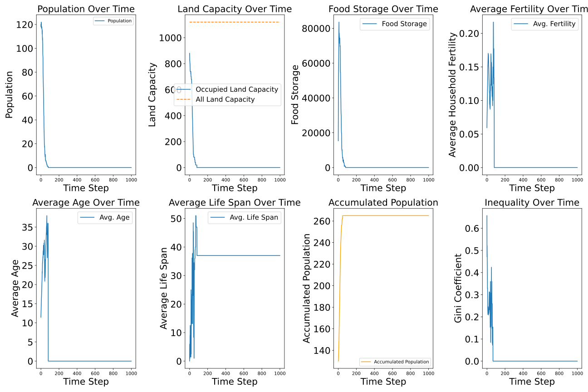

# Agent-Based Model 2024 Version
**Author**: Yutong Liang  
**Supervisor**: Dániel Kondor​  
**Topic**: Investigating Social Dynamics and Inequality in Neolithic Societies Through Agent-Based Modelling
### Introduction

The difference between this branch `land_constant` and the main branch is that the land quality is manually kept constant. It will not be changed. The land quality value is set to be the same for each with a high value.  
  
This is designed to explore what will happen when there are abundant food for the villagers.  
  
### Result Log

`land_constant` 30-01-2025&21-28-42 can be compared with `main` 29-01-2025&23-47-09. The only difference is the land quality setting. 
Vec1:
```
vec1 = pd.read_csv('demog_vectors.csv')
vec1 = vec1.rename_axis('age').reset_index()
new_max_age = 60
old_max_age = vec1['age'].max()
scale_factor = new_max_age / old_max_age
scale_factor = 1
other_para = ['rho', 'pstar', 'mortparms']
bins = pd.cut(vec1['age'], bins=new_max_age)
binned_vec = pd.DataFrame()
for col in other_para:
    binned_col = vec1.groupby(bins, observed=False).agg({col: 'mean'}).reset_index()
    binned_col[col] = binned_col[col] * scale_factor
    binned_vec[col] = binned_col[col]

bin_centers = [interval.mid for interval in binned_col['age']]

binned_vec = binned_vec.rename_axis('age_new').reset_index()
binned_vec.loc[binned_vec['age_new'] <= 3, 'pstar'] *= 0.5
binned_vec['mstar'] = vec1['mstar']
binned_vec['fertparm'] = vec1['fertparm']
binned_vec['mortscale'] = vec1['mortscale']
binned_vec['fertscale'] = vec1['fertscale']
binned_vec['phi'] = vec1['phi']
vec1 = binned_vec
```

`land_constant` branch:



`main` branch:


